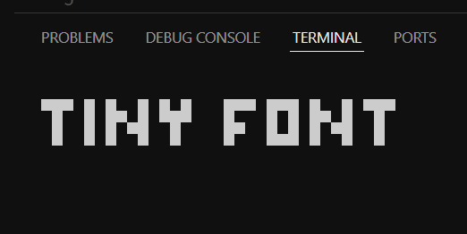

## Fountainpen

the ink framework

features:

- [Router ✨](#router-)
- [Components](#components) `NEW`
- [Extened ink elements](#extened-ink-elements)
- [Global input handler](#global-input-handler)
- [Custom hooks](#hooks)

plans:

- [ ] Fullscreen
- [x] Allow non Route children
- [x] Font Renderer

### Router ✨

A custom router with slugs

app.tsx

```tsx
...
  <Router fallback={<Error />}>
    <Text>Global Header</Text>
    <Route path="/" element={<Index />} />
    <Route path="/products" element={<Products />} />
    <Route path="/products/:id" element={<Details />} />
    <Route path="/test">
      <Text>Test page</Text>
    </Router>
  </Router>
...
```

pages/index.tsx

```tsx
export default function Index() {
  return <Text>Index</Text>;
}
```

pages/products.tsx

```tsx
export default function Products() {
  const { navigate } = useRouter();

  const home = () => navigate("/");
  // or
  const home = () => navigate("..");

  return <Text>...</Text>;
}
```

pages/products/id.tsx

```tsx
export default function Details() {
  const { slugs } = useRouter();

  return <Text>Slug: {slugs.get("id")}</Text>;
}
```

pages/error.tsx

```tsx
function Error() {
  const { path, navigate } = useRouter();

  useInput((input, key) => {
    if (key.return) {
      navigate("/");
    }
  });

  return <Text>'{path}' not found. Press enter to go back to home.</Text>;
}
```

### Components

#### Font

Supports all `Text` properties and is 2 lines tall.

<sub>`tiny` font is from `opentui`</sub>.

Currently `tiny` is the only available font and it is also the default.


```tsx
...
  <Font font="tiny">Tiny Font</Font>
...
```



### Extened ink elements

#### Box

```diff
- import { Box } from "ink";
+ import { Box } from "fountainpen";
```

```diff
- <Box width={"100%"} height={"100%"}></Box>
+ <Box size={"100%"}></Box>
```

### Global input handler

A global and more performant way to manage user input.

```tsx
render(
  <GlobalInputProvider>
    <App />
  </GlobalInputProvider>
);
```

```tsx
export default function App() {
  const { exit } = useApp();

  useGlobalInput((input, key) => {
    if (key.ctrl && input.toLowerCase() == "q") {
      exit();
    }
  });

  return <Text>Hello, World!</Text>;
}
```

### Hooks

- `useScreenSize` -> get width, height of terminal screen.
